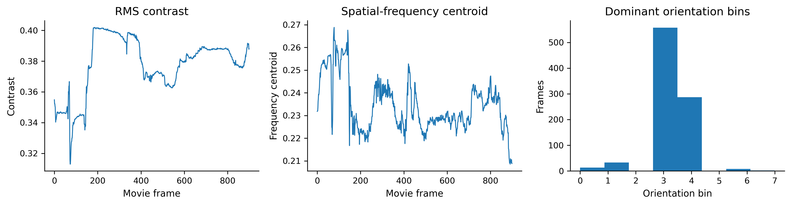
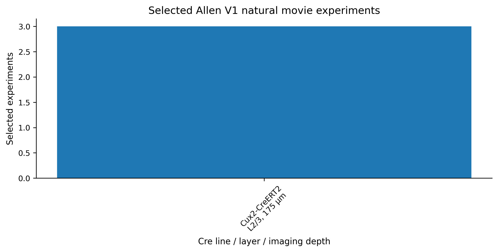
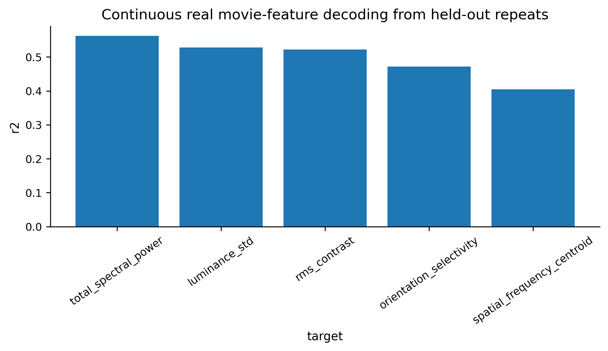
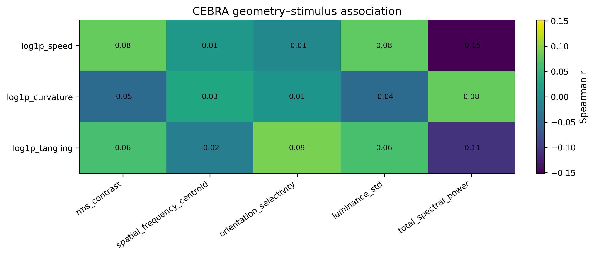

# NeuroAI

Public home for the project collection, starting with **Latent manifold geometry of V1 population codes during natural movie viewing**.

## Featured project

This project analyzes Allen Brain Observatory V1 calcium-imaging recordings from mice viewing natural movies. It asks whether population activity occupies a low-dimensional manifold and how that geometry relates to stimulus structure, representation choice, and neural organization.

The current version is a serious exploratory showcase with real AllenSDK/NWB data, real stimulus features, leakage-aware decoding, manifold geometry summaries, and brain-model alignment analyses.

## Snapshot

| Item | Status |
|---|---|
| Processed sessions | 3 |
| Represented layers | 1 |
| Represented Cre lines | 1 |
| Main signal | Held-out-repeat decoding of real natural-movie features |
| Main caution | Multi-session layer-level claims are not ready yet |

## What you will find

- Data acquisition and validation
- DeltaF/F preprocessing and trial tensor construction
- PCA, UMAP, ISOMAP, and CEBRA embeddings
- Geometry metrics such as speed, curvature, tangling, and intrinsic dimensionality
- Stimulus decoding and encoding with null controls
- RSA and CKA comparisons against analytic and deep visual features
- A read-only publication audit and manuscript planning scaffold

## Highlights

### Real stimulus features

The analysis uses features extracted from the actual Allen natural movie frames, not synthetic labels.

### Stimulus and cohort selection

The repository tracks the selected V1 experiments and the current cohort composition.

### Continuous decoding

The strongest results currently come from continuous feature decoding, especially under repeat-aware and block-aware evaluation.

### Geometry and interpretability

Latent geometry events sometimes align with visually interpretable stimulus segments, but the current evidence is descriptive rather than causal.

## Why this matters

The project combines public neuroscience data, careful controls, and modern representation-learning tools. It is not a pretty-manifold-only story. The site is intended to show both the signal and the limits honestly.

## Project links

- [Main README](../README.md)
- [Publication audit](../scripts/publication_audit_readiness.py)
- [Streamlit app](../app/streamlit_app.py)
- [Figures](../reports/figures/)
- [Tables](../reports/tables/)

## Future NeuroAI projects

This repository is intended to become a growing home for related NeuroAI projects over time.

